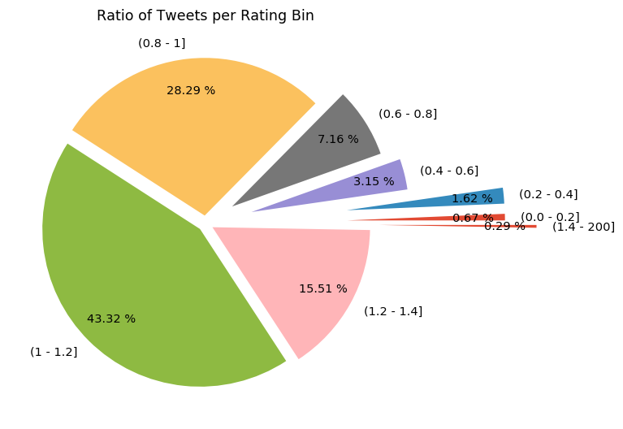
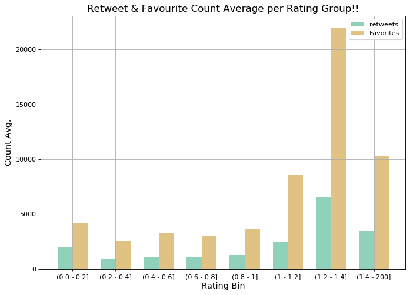

# 
WeRateDogs Twitter Archive Analysis

 

This report aims to share my analysis for the twitter archive of [WeRateDogs](https://twitter.com/dog_rates). We have extracted data from their tweets that are available online and analyzed various aspects. 

Main parameters that we have taken into account for this analysis are individual tweets, the rating they received and the number of retweets/favorites that they got. Retweets and Favorite counts shows how popular and liked a particular tweet was among the followers.

One more dataset has been used which was generated by [neural network](https://www.youtube.com/watch?v=2-Ol7ZB0MmU) to predict the dog breed. It only contains top 3 image predictions. We will cover this in the later part.

 

### What's the most common rating? 
Through the data we have gathered for WeRateDogs twitter Archive, we have come up with some quite interesting findings.

-	87.08 % of the tweets that are posted by WeRateDogs, get a rating in range (0.8 – 1.4]. Or we can also say that if WeRateDogs is posting a tweet, the probability that it will receive a rating in range (0.8 – 1.4] is 0.8708
-	71.58 % of the tweets that are posted by WeRateDogs, get a rating in range (0.8 – 1.2]

 

### What tweets are most liked? 
We also have another interesting analysis that shows the average retweets and favorites count received for each rating bin.

- Well, quite clearly the bars for the range (1.2 - 1.4] quite shoot up. It goes to show that the dogs/tweets that receive a rating in range (1.2 - 1.4] are liked the most and hence retweeted/favorited the most. Around 15.51 % of tweets receive ratings in this range.
- We have next high bars for rating above 1.4. Very small percentage of tweets (0.29 %) receive these ratings. Quite strangely they are liked lesser than (1.2 - 1.4].
- One more interesting point to note in this graph is for Dogs falling in range (0 - 0.2]. Again, quite strangely, they receive even higher retweet and favorites than those in range (0.2 - 1].

 

### Predicting dogs in tweets through NN 
We also have data available from neural network where we predict the breed of the dog.
Here p1 represents the algorithm’s first mostly likely prediction, p2 represents second most likely prediction and p3 represents third most likely prediction.
- The neural network predicts the dog in the image, 73.8 % of the times for p1. Also, the probability of correctly identifying dog's breed given they are predicted as dog, is 0.614 as per p1.
- The probability of correctly idenfying dog's breed given they are predicted as dog as per p2, is 0.140
- The probability of correctly idenfying dog's breed given they are predicted as dog as per p2, is 0.062

Given the above observations, the decline in probability of correctly identifying the dog's breed in p1, p2 and p3 is quite clearly evident.

 

### Pre-requsite:
> - pip install pandas
> - pip install tweepy
> - pip install matplotlib

